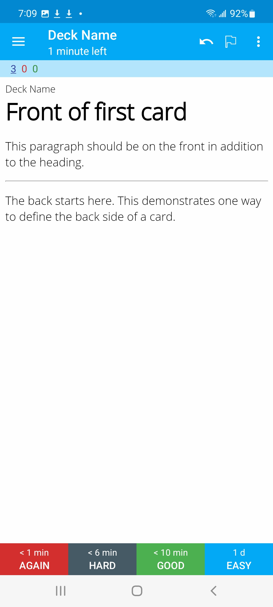
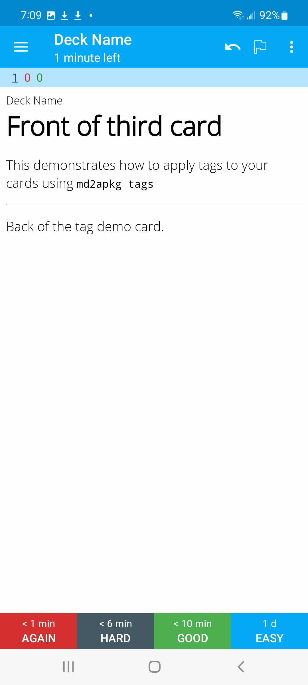
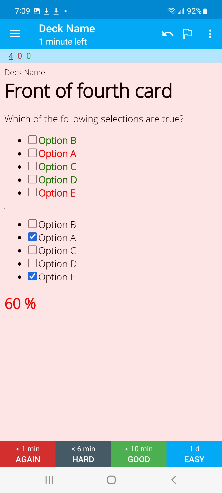
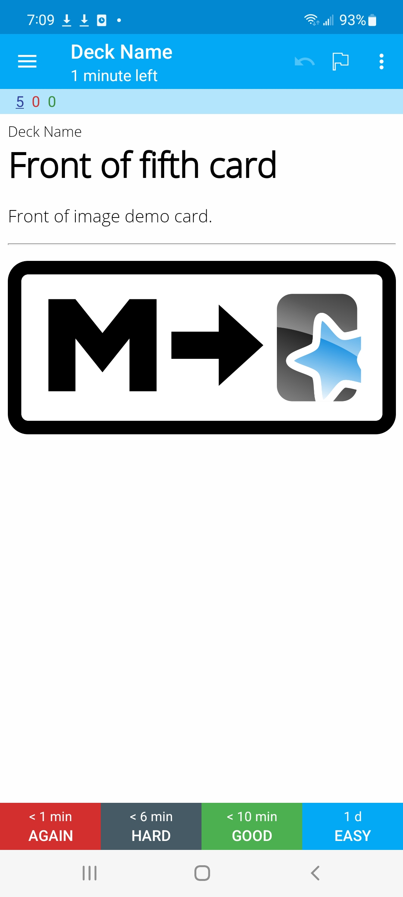

# convert-md-into-anki-flashcards

## Quickstart Guide

1. Fork this repo
2. Modify `flashcards.md` directly
3. Push your changes (i.e. commit directly to main branch)
4. Click the `Actions` tab
5. Click "Convert flashcards.md to flashcards.apkg" beneath "All workflows"
6. Click "Run workflow"
7. Click "Convert flashcards.md to flashcards.apkg" beneath "workflow runs"
8. Click "artifact" under "Artifacts produced during runtime"
  - The artifact is a `.zip` file containing the `flashcards.apkg` Anki flashcard deck, which you just built from `flashcards.md` in the previous steps
  - You can import `flashcards.apkg` directly into Anki using the desktop or mobile app (you'll just need to unzip/extract it after downloading)

## Who is this for?

If you like Anki flashcards, and want to make your own custom decks using Markdown, this repo can help.
I love Anki flashcards, and I wanted to make it easy to maintain my own decks.
This repo lets you or I create and maintain decks using GitHub as a version control system, and you can build decks in your browser without ever leaving GitHub's website or downloading any tooling.

## How does it work?

This repo is a thin wrapper around [`md2apkg`](https://github.com/Steve2955/md2apkg) (converts `.md` to the format Anki requires, `.apkg`. [Click here](https://github.com/Steve2955/md2apkg) to navigate to that repo, props to the author).

The feature set for creating cards is limited compared to what Anki offers, but it offers all the features I care about.

The pain point this repo solves is that `md2apkg` requries you to work locally as far as I can tell. I generally don't like installing tools on my desktop and wanted GitHub Actions to do the heavy lifting for me, hence the creation of `convert-md-into-anki-flashcards`. This repo basically lets GitHub Actions do the heavy lifting.

This repo functions as a template. You'll need to fork a copy and work from that.

## Future

I'm interested in finding a way to nest `.md` files in e.g. a folder hierarchy, then automatically using that hierarchy to infer / apply tags or subdeck names. This feature is not implemented yet, right now everything is flat under `flashcards.md`, and you have to apply tags manually per the `md2apkg` docs.

## Examples (AnkiDroid screenshots of the results built from `flashcards.md`)

